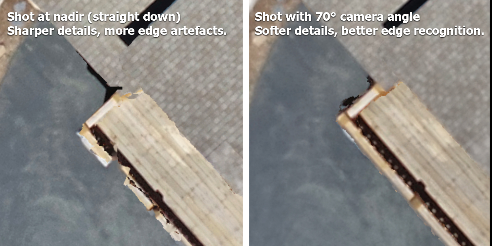

# Geofly Lab Drone Mapping Course

Maintained by Bo Yang and Henri Brillon

### Course description

This open-access drone mapping training course teaches the skills and knowledge required to produce maps with drones. All major steps are covered, including drone flight, mission planning, field data collection, post-processing using photogrammetry techniques, and geographical information system (GIS) analysis of the resulting products. Collection of high-precision ground control points (GCPs) using a GNSS receiver, as well as real-time kinematic (RTK) and post-process kinematic (PPK) corrections, is also covered. 

Drones (also known as UAVs and UAS) provide advantages over other remote sensing approaches with their high spatial resolution, temporal flexibility, and ability to repeat photogrammetry. Research applications include coastal mapping, habitat monitoring, fire behavior analysis, defensible space assessments and more. This training course allows research partners and broader communities to learn how to fly drones, and perform data processing.

 **Course Objectives**
 
1.	Basic knowledge of drone setup and maintenance. 
2.	Manual and automated flight operations.
3.	Efficiency and safety in compliance with FAA regulations.
3.	FAA part 107 exam preparation -- airspace regulations, sectional charts, etc.
4.	Safety guidelines when flying drones. 
5.	Pre-flight planning using DJI GS Pro for collecting field data. 
6.	Collecting Ground Control Points (GCPs) using Esri Field Maps (upcoming).
7.	Real-time positional corrections using RTK (upcoming).
8.	Post-processing positional corrections using PPK (upcoming).
9.	Post-processing using photogrammetry software such as Esri Drone2Map (stitching and georeferencing).
10.	Post-processing of LiDAR point clouds using DJI Terra (upcoming).
11.	Data management and cloud storage of drone imagery.
12.	Basic GIS analysis on drone imagery, digitizing, multi-spectral band math, vegetation index, and image classification. 

The training program is divided into five training sections and one post-training self-study guide to prepare participants for the FAA Part 107 examination. This examination is necessary for commercial-based drone operators to conduct flights in the United States. 

# 1. Drone Basics

Before drone operation, it is essential to understand some basics of manipulation, assembly, setup software, and calibration. Here, we cover these elements using the DJI Phantom 4 Pro quadcopter as an example. This video lecture walks users through every step, from unboxing to software setup and safety requirements. Flight planning is covered in a later section.

### Before Drone Operation

*	Read the [Phantom 4 manual](/Documents/Phantom_4_User_Manual_v1.6.pdf) 
*	Review the drone, its basic flight manipulation, rules and regulations for drone flights.
*	Read through the [operations manual and safety guidelines](Documents/CSGIS_Preflight_Planning_and_Safety.pdf) 
*	Practice flying the drone, icluding the controls, manual drone operations, takeoff and landing, changing altitude, and adjusting camera and video settings

### Tutorial Videos

[(1/5) DJI Phantom 4 Unboxing & Assembly](https://www.youtube.com/embed/4PYAk11Jio8)

[(2/5) DJI Phantom 4 Software Setup](https://www.youtube.com/embed/EFAxI218N7s)

[Official DJI Calibration Tutorial](https://www.youtube.com/embed/2WltMwrWlyM)

### Registering your Drone

Drone registration with the FAA is mandatory in the United States for drones weighing 0.55 pounds (250 grams) or more. Please visit the [FAA drone registration page](https://www.faa.gov/uas/getting_started/register_drone) for details.

**IMPORTANT!** The drone industry is growing and changing fast, and regulations are often changed and updated. For example, since September 2023, all drones requiring registration must operate in accordance with the new [remote ID rule](https://www.faa.gov/uas/getting_started/remote_id). **For this reason, we strongly recommend that you check the rules regularly with the FAA. Do not rely solely on this guide to ensure compliance.**

Again, please visit the [FAA drone registration page](https://www.faa.gov/uas/getting_started/register_drone) for details.
 
“Failure to register with the FAA could result in one or a combination of the following: a civil penalty of up to $27,500; a criminal fine of up to $250,000; imprisonment for up to three years.” - FAA

Directions for drone registration with the FAA (last updated 12/27/2023):
1.	Visit the [FAA drone registration page](https://www.faa.gov/uas/getting_started/register_drone).
2.	Create and verify an account.
3.  Add a service, then under "Drone Owners and Pilots" click "Select Drone Owners and Pilots Service".
4.  The new service now appears in your account. Select "Launch Drone Owners and Pilots Dashboard".
5.  Select Part 107; recreational registration is not appropriate for commercial or research purposes.
6.  Fill in your personal information.
7.  Under the Part 107 Dashboard, click "Manage Device Inventory" then "Add Device".
8.  Fill out the remote ID information for your drone as illustrated - the serial number is unique to each drone and can be found inside the DJI flight control app [(DJI Forum)](https://forum.dji.com/thread-299314-1-1.html). 

9.  Click "Add Device".
10.  You should now be able to check out and pay the $5 fee for drone registration.
11.	Navigate back to your “FAA Part 107 Dashboard” and click “Manage sUAS Inventory”
12.	Find the drone that you registered and find the “Registration” column. 
13.	Mark your drone with the registration number according to the following FAA 

**Module Materials:**

[Phantom 4 manual](/Documents/Phantom_4_User_Manual_v1.6.pdf)

[operations manual and safety guidelines](Documents/CSGIS_Preflight_Planning_and_Safety.pdf)

# 2. In-Flight Operation

Following the overview of drone basics, we recommend a 1.5-hour manual flying session to learn how to control and manoeuver the drone. Through this interactive exercise, participants gain experience in basic drone operations. 

### Pre-Flight Safety Check

Every mission will have exposure to its own distinct set of hazards, so careful planning before drone operation is crucial for success. We encourage clear communication before each mission to ensure that every team member is aware of the operational plan and the hazards at hand.

As a helpful starting point, this safety checklist includes some elements common to all drone missions. Please remember that this is only a starting point, and that each mission must be planned for individually to account for all hazards.

* Remote pilot-in-command (PIC) checks for safety equipment (gloves, eye protection, safety vests, traffic cones, radios if necessary, life jackets if taking off from a boat, and any other necessary safety equipment).
* Remote PIC ensures stable communication between the controller and tha aircraft.
* Remote PIC checks the weather in advance of the mission **and** on the day of the mission. 
* Remote PIC is responsible for checking airspace authorizations in compliance with FAA Part 107 regulations and requesting any approvals in advance if required. **Note that advance authorizations through LAANC sometimes take several days for approval.**
* At all times, remote PIC is responsible for carrying out operations safely, and always makes the final decision on whether the mision will proceed.
* Flight is not permitted directly over non-participating people.   
*	Because coastal mapping with drones often includes taking off and landing on a boat, hand catching of the drone needs to be practiced for both takeoff and landing.
*	Focus on maintaining visibility and line of sight with the drone and avoiding hazards.

### Drone Calibration

Drone calibration is sometimes required to ensure correct compass operation. Follow the on-screen instructions in the DJI Go 4 app and watch the video below for more information on drone calibration.

[(3/5) Drone Calibration & Software Setup](https://www.youtube.com/embed/jpWw9_WZGHU)

### Airspace Regulations 

Below is a non-exhaustive list of airspace regulations that must be complied with at all times during drone operation. Failure to comply with any of these regulations can impact flight safety, so it's imporatant to be aware of these. For a complete overview of the FAA's requirements, visit the [Part 107 regulations page](https://www.faa.gov/newsroom/small-unmanned-aircraft-systems-uas-regulations-part-107).

* Always avoid manned aircraft.
* Never operate in a careless or reckless manner.
* Keep your drone within sight. If you use First Person View or similar technology, you must have a visual observer always keep your drone within unaided sight (for example, no binoculars).
* You cannot be a pilot or visual observer for more than one drone operation at a time.
* Do not fly a drone over people unless they are directly participating in the operation.
* Do not operate your drone from a moving aircraft.
* Do not operate your drone from a moving vehicle unless you are flying your drone over a sparsely populated area and it does not involve the transportation of property for compensation or hire.
* Maximum altitude is 400 feet above ground level (AGL) or 400 feet above a structure being surveyed.
* Maximum flight speed is 100 mph.
* Minimum weather visibility is three miles from your control station.
* Waivers can be requested for operations beyond visual line of sight, during nighttime, and over people. You must be able to show that your operation will provide equivalent safety.
* Drones must be registered with the FAA unless they weight 0.55 pounds (249 grams) or less.
* You may operate in Class G airspace without air traffic control (ATC) authorization. Operations in Class B, C, D, and E require prior authorization. Request authorizations using the [Low Altitude Authorization and Notification Capability (LAANC)](https://www.faa.gov/uas/programs_partnerships/data_exchange).

Note: There are similar regulations in Canada. All drones that weigh between 250 g and 25 kg must be registered with Transport Canada. FAA certification (U.S.) is not applicable in Canada, and drone pilots must follow the rules in the Canadian Aviation Regulations (CARs) Part IX—Remotely Piloted Aircraft Systems.

For more FAA regulation, please read [FAA remote pilot study guide](/Documents/remote_pilot_study_guide.pdf)

**Module Materials:**

[FAA remote pilot study guide](/Documents/remote_pilot_study_guide.pdf)

# 3. Autonomous Mapping

Autonomous mapping provides an advantage over manual flight operations by ensuring that data collection is efficient and replicable at each site. In this module, we learn how to use autonomous functions to capture hundreds of images that were pre-programmed to be evenly distributed over the mapping area, as illustrated below.

*	Read the [CSGIS_Preflight_Planning_Document] (/Documents/CSGIS_Preflight_Planning_Document.pdf) in the course material, learn to use DJI GS Pro app for auto-pilot and safety guidelines. 
*	Learn how to plan and create autonomous flights with different mapping parameters.
*	We recommend UAV flight path set to be parallel with the long side of the mapping area in order to minimize the UAV turning points and maximize battery efficiency.
*	Rain, wind, and fog all frequently occur in coastal areas and influence drone flights. To address that, flights need to be conducted with wind speeds less than 10 m/s, no heavy rain and no fog. FAA Part 107 regulations state that the UAV should not be flown in fog or other situations where the operator loses line of sight.

[(4/5) Create drone mapping task using DJI GS Pro](https://www.youtube.com/embed/n2iIS3-4z-8)

### Mapping planning & settings

Participants learn how to plan and create a new flight area using autonomous flights with different mapping parameters. Considerations for autonomous parameters include: 

* Number of available batteries, and size of the study area;
* Composition of the study area (i.e. the more homogeneous the study area, the more front and side overlap is required to obtain good results)
*	Tradeoffs between spatial coverage and spatial resolution (e.g., if drones fly at a higher elevation, the image coverage is larger, but the spatial resolution is coarser and vice versa); 
*	Appropriate settings of the camera model for a proper shooting angle to minimize sun glint; 
*	How flight direction and capture mode vary depending on the shape of the site and the wind directions; 
*	How front/side overlap ratio is related to flying time and the number of batteries needed.

 

* Tradeoffs between using nadir (straight down) shooting angle with a 2D template in GS Pro and shooting at an angle with a 3D template in GS Pro

Once you have reviewed and understood the various automated flight parameters, watch the video on unlocking flight zones and using GS Pro for autonomous mapping linked below.

[(5/5) Unlocking No-Fly Zones and Using DJI GS Pro for Autonomous Mapping](https://www.youtube.com/embed/Op4rjLfgmpA)

### Mapping Planning 

**Module Materials:**

[CSGIS_Preflight_Planning_Document](/Documents/CSGIS_Preflight_Planning_Document.pdf)

# 4. Image Processing

This section covers image stitching, geo-referencing, derivation of orthomosaics and elevation models, and image correction. Also, we will review the importance of visually inspecting all drone images to rule out low-quality images (e.g., blurry or oblique) and minimize measurement error in the final data products. This module will also cover the use of Esri Drone2Map software to stitch together hundreds of separate images collected by drones in the field and geo-register them into orthomosaics.

### Image stitching and GIS 

Photogrammetry post-processing is the use of structure-from-motion algorithms by a computer program to find matches between neighboring images, and stitch them together into a fully nadir orthomosaic. A 3D point clound can also be generated, resulting in a digital surface model (DSM) and corresponding elevation data. This course uses Esri's Drone2Map to achieve this, but it's worth noting that other programs also offer these capabilities, including Pix4D, Agisoft Metashape, WebODM and more.

*	Read the [CSGIS_Drone2map User Guide](/Documents/CSGIS_Drone2map_User_Guide.pdf).
*	[The FAIR Guiding Principles for scientific data management and stewardship](https://www.nature.com/articles/sdata201618)	(Wilkinson et al., 2016)

Note: Drone2Map software package could be downloaded from the course material resources folder. Sample data are provided in the course folder.

**Geo-referencing**

One of the biggest challenges of coastal and forest drone mapping is that a relatively homogeneous surface leads to difficulties in registering images because the image mosaic algorithm usually needs some target on the image as a matching point to stitch together images with overlaying parts.

For points on land, we used obvious objects, such as red buckets or orange traffic cones that could be easily identified in the drone image. For image referencing over the water, we used light-colored buoys with anchors fixed on the water surface to serve as the Ground Control Point (GCP). It is recommended to collect 10 points at each monitoring site. On land, use colorful objects, such as red buckets, that could be easily identified in the drone image. Over water, use light-colored buoys with anchors fixed on the water. When collecting GCPs, we recommended starting the GPS and waiting until there are more than 12 satellites available for calculating the position. For each GCP location, we encourage to wait at least 90 seconds until the GPS signal became stable. Usually, GPS accuracy can reach 30-50 cm under cloudless weather conditions. For each GCP location, collect 20 repeated measurements and use the average value as the input coordinates for geo-referencing.

### Orthomosaic & Elevation Data

*	Learn the [ArcGIS based Image Analyses Manual](/Documents/CSGIS_ArcGIS_based_Image_Analyses_Manual.pdf)
*	GIS analysis includes: geodatabase management, digitizing raster imagery, pixel/object based classification methods, band math, and calculations of vegetation indexes (e.g., Green Leaf Index and NDVI). The canopy information, such as Leaf Area Index (LAI) can be derived from drone imagery as well (Roth et al 2018). 

Note: ArcGIS and Drone2Map software packages could be downloaded from [Esri](https://www.esri.com/en-us/home).

Furthermore, drone mapping can generate additional elevation data products, such as Digital TerrainModels (DTM) and Digital Surface Models (DSM). Such products are useful for topography analysis and 3D visualization. The video below shows the high-resolution orthomosaic imagery combined with the high-resolution Digital Elevation Model to form a 3D visualization.

Video: [UAV/drone high-resolution 3D fly-through video for Bodega Marine Laboratory (BML)](https://www.youtube.com/embed/yaX336s4DjE)

**Module Materials:**

[Processing the drone imagery to mapping products](/Documents/CSGIS_Drone2map_User_Guide.pdf)

[Data analysis in Geographical Information Science (GIS)](/Documents/CSGIS_ArcGIS_based_Image_Analyses_Manual.pdf)

# 5. Post-training Self-study

### Self-study for FAA UAS Exam

To obtain Part 107 certification from the FAA, pilots must successfully complete a theoretical exam in-person at an FAA approved testing center. The exam is 60 multiple-choice questions, and covers topics including but not limited to airspace regulations, sectional chart reading, meteorological knowledge, aircraft safety, and pilot responsibility. The current cost is $175, and the passing grade is 70%, or 42 correct answers out of 60. (Last updated 12/28/2023)

The Part 107 exam requires specialized knowledge, and we recommend dedicating at least 10 hours to self-paced study to maximize chances of obtaining a passing grade. In order to fly drones for research purposes under the FAA’s Small UAS Rule (Part 107) in the U.S., one must obtain a Remote Pilot Certificate from the FAA. This certificate demonstrates that the remote pilot understands the regulations, operating requirements, and procedures for safely flying drones.

**Module Materials:**

[FAA remote pilot study guide](/Documents/remote_pilot_study_guide.pdf)

[Self-study for FAA part 107 exam](/Documents/CSGIS_Instruction_for_FAA_Part_107_Examination.pdf)

Above training document reviewed content from the course modules as well as additional material necessary to prepare for the drone examination, including airspace concepts, weather sources, radio communications, sectional charts, and drone physics. It also includes additional online resources and sample questions for the examination.

## Before Flight Check-list
*	Registered the drone with FAA, checked the [airmap](https://app.airmap.com/geo?28.626370,-81.461372,9.245341z) or [B4Ufly](https://www.faa.gov/uas/recreational_fliers/where_can_i_fly/b4ufly/) that the mapping area is approved by FAA.
*	Install “DJI Go 4” and “DJI GS Pro”. Note GS pro only available on iPad (no iphone version).
*	Charge both controller and drone batteries. Each battery takes about 1 hour and 20 minutes to charge to full, the controller needs about 3 hours. There are two charging ports on the original charger, one for the controller and one for battery.
*	There is a 32gb sd card coming with the drone. Make sure to clear it before going to the field. If using a computer to format, use the fat32.
*	Take a test fly to confirm everything is good and the drone can take off. If the drone is good to be taken off, that will save lots of the time when doing the mapping in the field.
*	Check weather before heading out to ensure no rain, high wind or fog is forecasted.
*	In the field, check for an appropriate takeoff and landing area with line of sight to the entire study area.
*	Check everything is good using DJI GO 4 before use GS pro, then go to GS Pro and click to fly. The take-off location is better to be flat, dry and close to the mapping area as much as possible to save the battery. 
*	When the drone flies to the area and starts mapping, turn on the sound of the ipad and hear the shutter sounds every 2-3s. If there is no sound, you may have accidentally clicked video shooting before the mapping, and your data will be unusable.

## Resources:

[Esri training course](https://www.esri.com/training/) 
*       Drone2Map for ArcGIS: Bring Drone Imagery into ArcGIS (69min)
*       Getting Started with Drone2Map for ArcGIS (2h15min)
*       Creating 2D Products Using Drone2Map for ArcGIS (2hrs)
*       Working with Full Motion Video in ArcGIS (2hrs)
*       Creating 3D Products Using Drone2Map for ArcGIS (4h45min)

[Citizen Sience GIS NSF Drone mapping project](https://www.citizensciencegis.org/nsfsmithsoniandrones)

 

