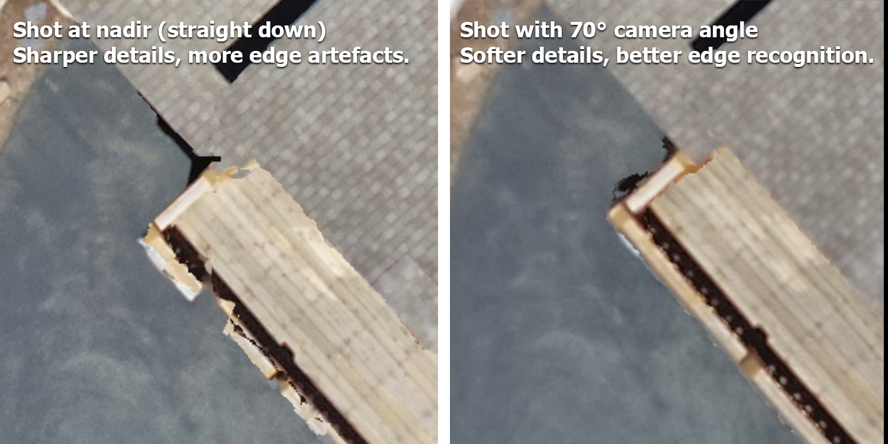

# GeoFly Lab Drone Mapping Course

Maintained by Bo Yang and Henri Brillon

### Course Description

This open-access course introduces the complete drone mapping workflow for coastal management, habitat monitoring, and applied geospatial research. Participants learn how to plan safe missions, collect field imagery, document ground control, process imagery into mapping products, and analyze the resulting data in a geographic information system (GIS).

The course emphasizes practical field workflows used by GeoFly Lab and collaborators in coastal, ecological, wildfire, and community resilience projects. Drones, also called uncrewed aircraft systems (UAS), are useful because they provide high spatial resolution, flexible timing, and repeatable data collection across sites. These advantages make drone mapping especially valuable for coastal seagrass monitoring, fire behavior and post-burn assessment, defensible space evaluation, and other environmental applications.

The training is organized into five instructional modules and a self-study section for FAA Part 107 preparation. Regulatory information changes over time, so participants should always confirm current requirements with the FAA before flying.

**Course Objectives**

1. Understand drone hardware, setup, calibration, maintenance, and field readiness.
2. Practice manual flight operations, takeoff, landing, camera control, and emergency procedures.
3. Plan safe missions in compliance with FAA rules, airspace restrictions, weather limits, and site-specific hazards.
4. Prepare for the FAA Part 107 Remote Pilot knowledge test, including airspace, weather, sectional charts, operations, and pilot responsibility.
5. Design autonomous mapping missions with appropriate altitude, overlap, flight direction, battery planning, and camera settings.
6. Collect and document ground control points (GCPs) for accurate georeferencing.
7. Understand RTK and PPK workflows for improving positional accuracy.
8. Process drone imagery into orthomosaics, digital surface models, point clouds, and related mapping products.
9. Manage drone imagery and derived data using reproducible file organization and backup practices.
10. Conduct GIS analysis on drone-derived products, including digitizing, vegetation indices, band math, and image classification.

The modules are designed to support both classroom instruction and field-based training. Research and professional drone operations in the United States generally require compliance with FAA Part 107 unless a different legal operating framework applies.

# 1. Drone Basics

Before operating a drone, participants should understand the aircraft, controller, batteries, sensors, software, and calibration procedures. This module uses the DJI Phantom 4 Pro as the primary example, but the same field-readiness principles apply to other mapping platforms. Flight planning and autonomous mapping are covered in later modules.

### Before Drone Operation

* Read the [Phantom 4 manual](/Documents/Phantom_4_User_Manual_v1.6.pdf).
* Review basic controls, aircraft status indicators, battery management, camera settings, and emergency procedures.
* Read the [operations manual and safety guidelines](Documents/CSGIS_Preflight_Planning_and_Safety.pdf).
* Practice manual flight skills, including takeoff, landing, altitude changes, positioning, camera control, and safe return-to-home procedures.

### Tutorial Videos

[(1/5) DJI Phantom 4 Unboxing & Assembly](https://www.youtube.com/embed/4PYAk11Jio8)

[(2/5) DJI Phantom 4 Software Setup](https://www.youtube.com/embed/EFAxI218N7s)

[Official DJI Calibration Tutorial](https://www.youtube.com/embed/2WltMwrWlyM)

### Registering Your Drone

In the United States, drone registration is handled through [FAA DroneZone](https://faadronezone.faa.gov/). The FAA states that all drones must be registered unless they weigh 0.55 pounds or less (less than 250 grams) and are flown only under the Exception for Limited Recreational Operations. Research, teaching, and professional mapping activities should normally be registered and operated under Part 107 unless another authorized framework applies.

**Regulatory note, verified May 2026:** FAA rules and platforms change. The FAA currently lists Part 107 registration as $5 per drone, valid for three years. Drones that are required to be registered, or that are registered, must comply with Remote ID unless they are operating within an approved exception such as a FAA-Recognized Identification Area (FRIA). Always confirm registration, Remote ID, airspace, and operating requirements on official FAA pages before flight.

Suggested registration workflow:

1. Visit the [FAA drone registration page](https://www.faa.gov/uas/getting_started/register_drone) and open FAA DroneZone.
2. Create or verify your FAA account.
3. Select the drone owner and pilot service.
4. Choose the correct operating category. For research, teaching, and professional mapping, use Part 107 rather than recreational registration.
5. Enter the owner, aircraft, make/model, and Remote ID serial number information requested by FAA DroneZone.
6. Pay the registration fee and download or save the registration certificate.
7. Label the aircraft with the FAA registration number before flight.
8. Keep a paper or digital copy of the registration certificate available during operations.

**Module Materials:**

[Phantom 4 manual](/Documents/Phantom_4_User_Manual_v1.6.pdf)

[operations manual and safety guidelines](Documents/CSGIS_Preflight_Planning_and_Safety.pdf)

# 2. In-Flight Operation

After reviewing drone basics, we recommend a 1.5-hour manual flight session before any autonomous mapping mission. Participants should practice takeoff, landing, aircraft orientation, altitude control, camera operation, emergency stop procedures, and return-to-home behavior in an open and low-risk environment.

### Pre-Flight Safety Check

Every mission has site-specific hazards, so careful planning is essential. Before launch, the remote pilot in command (PIC) should brief the team on the mission objective, airspace status, weather, takeoff and landing area, emergency procedures, communication plan, and individual roles.

As a helpful starting point, this safety checklist includes some elements common to all drone missions. Please remember that this is only a starting point, and that each mission must be planned for individually to account for all hazards.

* Confirm aircraft, controller, propellers, batteries, memory card, firmware status, and payload configuration.
* Check required safety equipment, such as eye protection, safety vests, traffic cones, radios, gloves, and life jackets when operating near or from water.
* Confirm stable communication between the controller and aircraft.
* Check weather forecasts before the mission and observe conditions again on site.
* Confirm airspace status, LAANC or other authorization needs, nearby airports, temporary flight restrictions (TFRs), and local site restrictions.
* Maintain visual line of sight and avoid people, vehicles, structures, wildlife, and other aircraft.
* Do not fly directly over non-participating people unless the operation qualifies under the applicable FAA rules.
* For coastal missions involving boats or constrained launch sites, practice takeoff, landing, and hand-catching procedures only under controlled conditions with trained personnel.
* The remote PIC has final authority over whether the mission proceeds.

### Drone Calibration

Drone calibration is sometimes required to ensure correct compass operation. Follow the on-screen instructions in the DJI Go 4 app and watch the video below for more information on drone calibration.

[(3/5) Drone Calibration & Software Setup](https://www.youtube.com/embed/jpWw9_WZGHU)

### Airspace Regulations

Below is a non-exhaustive summary of Part 107 operating rules. Always confirm current requirements on the FAA website and in applicable local site policies before flight.

* Always avoid manned aircraft.
* Never operate in a careless or reckless manner.
* Keep your drone within sight. If you use First Person View or similar technology, you must have a visual observer always keep your drone within unaided sight (for example, no binoculars).
* You cannot be a pilot or visual observer for more than one drone operation at a time.
* Do not fly a drone over people unless they are directly participating in the operation.
* Do not operate your drone from a moving aircraft.
* Do not operate your drone from a moving vehicle unless you are flying your drone over a sparsely populated area and it does not involve the transportation of property for compensation or hire.
* Maximum altitude is 400 feet above ground level (AGL) or 400 feet above a structure being surveyed.
* Maximum flight speed is 100 mph.
* Minimum weather visibility is three miles from your control station.
* Some operations, such as beyond visual line of sight or certain operations over people, may require additional compliance steps or waivers.
* Drones used for Part 107 operations must be registered with the FAA.
* You may operate in Class G airspace without air traffic control (ATC) authorization. Operations in Class B, C, D, and E require prior authorization. Request authorizations using the [Low Altitude Authorization and Notification Capability (LAANC)](https://www.faa.gov/uas/programs_partnerships/data_exchange).

For quick airspace awareness, the FAA now lists multiple approved [B4UFLY desktop and mobile providers](https://www.faa.gov/uas/getting_started/b4ufly). B4UFLY provides situational awareness, but it does not replace the remote PIC's responsibility to verify airspace, authorization requirements, TFRs, weather, and site permissions.

Note: Regulations differ by country. In Canada, Transport Canada rules apply to remotely piloted aircraft systems; FAA certification is not a substitute for Canadian authorization.

For more FAA regulation, please read [FAA remote pilot study guide](/Documents/remote_pilot_study_guide.pdf)

**Module Materials:**

[FAA remote pilot study guide](/Documents/remote_pilot_study_guide.pdf)

# 3. Autonomous Mapping

Autonomous mapping improves field efficiency and repeatability by flying a planned route and collecting images with consistent overlap. In this module, participants learn how to design mapping missions that balance spatial resolution, coverage, battery limitations, wind, sun angle, site geometry, and safety.

* Read the [CSGIS Preflight Planning Document](/Documents/CSGIS_Preflight_Planning_Document.pdf) and review autopilot and safety procedures.
* Plan autonomous flights using mission parameters appropriate for the site and research objective.
* Align flight lines with the long axis of the mapping area when practical to reduce turns and improve battery efficiency.
* Avoid rain, fog, low visibility, and wind conditions that exceed aircraft, site, or pilot limits. Coastal missions require conservative weather decisions because wind and visibility can change quickly.

[(4/5) Create drone mapping task using DJI GS Pro](https://www.youtube.com/embed/n2iIS3-4z-8)

### Mapping planning & settings

Participants learn how to create a flight area and adjust mapping parameters. Key planning decisions include:

* Study area size and the number of available batteries.
* Surface texture and homogeneity; more uniform surfaces usually require higher front and side overlap.
* Tradeoffs between spatial coverage and ground sampling distance.
* Camera angle, exposure, and sun-glint management.
* Flight direction relative to site geometry, wind direction, and takeoff location.
* Frontlap and sidelap settings, flight time, and battery reserve.

 

* Tradeoffs between nadir imagery for 2D orthomosaics and oblique imagery for 3D reconstruction.

After reviewing the mapping parameters, watch the video on unlocking flight zones and using GS Pro for autonomous mapping.

[(5/5) Unlocking No-Fly Zones and Using DJI GS Pro for Autonomous Mapping](https://www.youtube.com/embed/Op4rjLfgmpA)

### Mapping Planning 

**Module Materials:**

[CSGIS_Preflight_Planning_Document](/Documents/CSGIS_Preflight_Planning_Document.pdf)

# 4. Image Processing

This section covers image quality control, photogrammetric processing, georeferencing, orthomosaic generation, surface model creation, and GIS analysis. Before processing, inspect all images and remove data that are blurry, overexposed, strongly oblique when a nadir mission was intended, or otherwise unsuitable for mapping. Quality control at this stage reduces error in the final products.

### Image stitching and GIS 

Photogrammetry software uses structure-from-motion and multi-view stereo methods to identify matching features across overlapping images, estimate camera positions, generate a point cloud, and produce georeferenced mapping products. Typical outputs include orthomosaics, digital surface models (DSMs), digital terrain models (DTMs), 3D meshes, and point clouds.

This course uses Esri's Drone2Map as the primary teaching platform. Other commonly used photogrammetry tools include Pix4Dmapper, Agisoft Metashape, OpenDroneMap/WebODM, and related cloud or desktop reality mapping platforms. Software choice should depend on project scale, licensing, processing resources, accuracy requirements, and integration with GIS workflows.

* Read the [CSGIS Drone2Map User Guide](/Documents/CSGIS_Drone2map_User_Guide.pdf).
* [The FAIR Guiding Principles for scientific data management and stewardship](https://www.nature.com/articles/sdata201618) (Wilkinson et al., 2016)

Note: Sample data are provided in the course folder. Participants should use licensed software available through their institution or approved project resources.

**Geo-referencing**

Coastal, wetland, and forest mapping can be difficult because water, vegetation, sand, and other homogeneous surfaces may provide fewer stable image-matching features. Ground control points (GCPs) and independent check points help improve and evaluate positional accuracy.

For land-based GCPs, use clearly visible targets such as survey panels, bright buckets, or traffic cones. For water or intertidal mapping, light-colored anchored buoys can be used when they are safe and visible in the imagery. A typical site should include well-distributed GCPs around the edges and interior of the mapping area, plus independent check points when possible.

When collecting GCPs, allow the GNSS receiver to stabilize, document the coordinate reference system, record metadata, and collect repeated measurements when appropriate. Accuracy will depend on equipment, correction method, satellite geometry, multipath, canopy, terrain, weather, and field procedures. RTK or PPK workflows can substantially improve positional accuracy when configured correctly.

### Orthomosaic & Elevation Data

* Learn the [ArcGIS-based Image Analysis Manual](/Documents/CSGIS_ArcGIS_based_Image_Analyses_Manual.pdf)
* GIS analysis includes geodatabase management, digitizing, raster analysis, pixel-based and object-based classification, band math, vegetation indices such as Green Leaf Index and NDVI, and accuracy assessment.

Note: ArcGIS and Drone2Map software are available from [Esri](https://www.esri.com/en-us/home), subject to institutional licensing.

Drone mapping can also generate elevation products such as DTMs and DSMs. These products support topographic analysis, vegetation structure assessment, erosion monitoring, 3D visualization, and change detection. The video below demonstrates a high-resolution orthomosaic combined with elevation data for 3D visualization.

Video: [UAV/drone high-resolution 3D fly-through video for Bodega Marine Laboratory (BML)](https://www.youtube.com/embed/yaX336s4DjE)

**Module Materials:**

[Processing the drone imagery to mapping products](/Documents/CSGIS_Drone2map_User_Guide.pdf)

[Data analysis in Geographical Information Science (GIS)](/Documents/CSGIS_ArcGIS_based_Image_Analyses_Manual.pdf)

# 5. Post-training Self-study

### Self-study for FAA UAS Exam

To fly under the FAA's Small UAS Rule (Part 107), a first-time remote pilot must meet FAA eligibility requirements and pass the Unmanned Aircraft General - Small (UAG) aeronautical knowledge test at an FAA-approved knowledge testing center. The FAA lists the basic eligibility requirements as being at least 16 years old, able to read, speak, write, and understand English, physically and mentally able to fly safely, and able to pass the initial aeronautical knowledge exam.

The UAG test includes topics such as airspace classification, operating requirements, flight restrictions, aviation weather, aircraft loading and performance, emergency procedures, crew resource management, radio communication, airport operations, night operations, maintenance, and preflight inspection. FAA remote pilot certificate holders must complete online recurrent training every 24 calendar months to maintain aeronautical knowledge recency.

Part 107 preparation requires focused study. We recommend reviewing the FAA Remote Pilot Study Guide, completing practice questions, reading sectional charts, and working through scenario-based flight planning exercises before scheduling the test.

**Module Materials:**

[FAA remote pilot study guide](/Documents/remote_pilot_study_guide.pdf)

[Self-study for FAA part 107 exam](/Documents/CSGIS_Instruction_for_FAA_Part_107_Examination.pdf)

The self-study document reviews course content and additional topics for the knowledge test, including airspace concepts, weather sources, radio communication, sectional charts, loading and performance, and sample questions.

## Before Flight Checklist

* Confirm that the drone is registered, labeled, Remote ID compliant, and appropriate for the planned operation.
* Confirm that the remote PIC has the required certificate, recurrent training status, documentation, and authorization for the mission.
* Check airspace, LAANC authorization needs, TFRs, local restrictions, landowner/site permission, and nearby hazards using official FAA resources and approved B4UFLY/LAANC providers.
* Install and test required flight apps before the field day. For legacy Phantom 4 workflows, this may include DJI GO 4 and DJI GS Pro; newer aircraft may require different mission planning software.
* Charge flight batteries, controller batteries, tablets, GNSS receivers, radios, phones, and backup power banks.
* Format and test memory cards, confirm sufficient storage, and verify that image capture settings match the mission plan.
* Inspect propellers, motors, landing gear, payloads, cables, and aircraft body condition.
* Check weather, including wind speed, gusts, precipitation, fog, visibility, temperature, tides where relevant, and expected changes during the mission window.
* Select a safe takeoff and landing area with line of sight to the mapping area.
* Conduct a short test flight when appropriate to confirm aircraft behavior, GPS status, camera triggering, and return-to-home settings.
* During autonomous mapping, confirm that the camera is capturing images at the expected interval. If the shutter is not triggering, stop the mission and troubleshoot before continuing.

## Resources

[Esri training course](https://www.esri.com/training/)

* Drone2Map for ArcGIS: Bring Drone Imagery into ArcGIS (69 min)
* Getting Started with Drone2Map for ArcGIS (2 h 15 min)
* Creating 2D Products Using Drone2Map for ArcGIS (2 h)
* Working with Full Motion Video in ArcGIS (2 h)
* Creating 3D Products Using Drone2Map for ArcGIS (4 h 45 min)

[FAA UAS / Drone Main Page](https://www.faa.gov/uas/)

[FAA Drone Registration](https://www.faa.gov/uas/getting_started/register_drone)

[FAA Remote ID](https://www.faa.gov/uas/getting_started/remote_id)

[FAA B4UFLY](https://www.faa.gov/uas/getting_started/b4ufly)

[FAA Become a Certificated Remote Pilot](https://www.faa.gov/uas/commercial_operators/become_a_drone_pilot)

[ArcGIS Drone2Map](https://www.esri.com/en-us/arcgis/products/drone2map/overview)

[OpenDroneMap](https://www.opendronemap.org/)

[Citizen Science GIS NSF Drone Mapping Project](https://www.citizensciencegis.org/nsfsmithsoniandrones)
